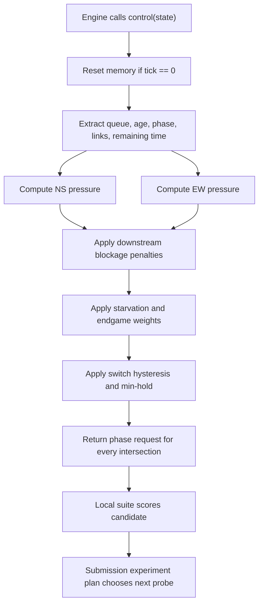
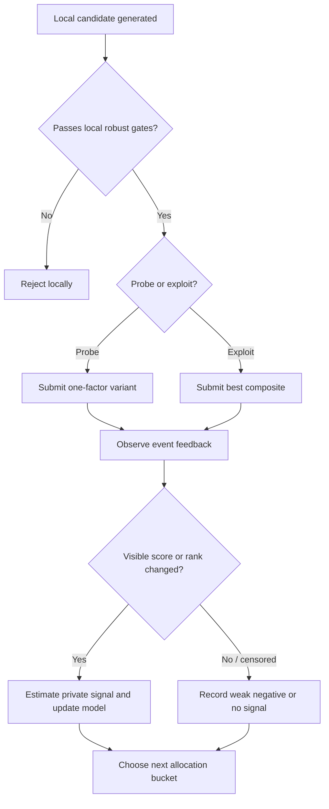

# Winning Controller Strategy Design

## Problem & Goal

Traffic Lights Arena is a short-horizon, stochastic, finite-capacity queueing game where the submitted artifact is `controller.py`. The goal is to maximize event score, not code quality: produce a one-file controller that beats the fixed-time baseline on public scenarios while remaining robust to private demand windows, directional surges, bursts, lane weighting, and sealed final maps. Success means the submitted controller returns valid phase requests every tick, reduces `wait_ticks + 300 * unfinished`, avoids overfitting public maps, and is selected as the team's best provisional submission before the final sealed evaluation.

## Scope

In scope:

- Design a winning controller policy for `control(state)` in `controller.py`.
- Define the model, policy inputs, scoring formula, local memory, and parameter tuning workflow.
- Define validation scenarios to reduce private-map risk.
- Treat the 20 unique submissions as a constrained experiment budget for learning which model assumptions transfer to private validation.
- Define the exact controller output contract and failure checks needed before submission.

Out of scope:

- Changes to `traffic_arena/engine.py`, `run.py`, `submit.py`, the viewer, or scoring rules.
- Clean architecture, reusable packages, broad refactors, or type-perfect abstractions.
- Training a full deep RL model unless the simple search approach plateaus and there is spare time.
- Any strategy that depends on organizer API internals, event-system behavior, or rule evasion.

Product constraints from [README.md](../../README.md):

- Contestants change one file: `controller.py`.
- Allowed returned phases are `NS_GREEN` and `EW_GREEN`.
- Engine owns minimum green, yellow, all-red, and safe transitions.
- Public score is only 20% of provisional/final weighting; private and sealed scenarios dominate.
- Submission budget is 20 unique submissions with cooldown. It is both a limit and the only live signal about private validation behavior.

## Data & Validation

No persistence or database schema changes.

The core validation target is the `control(state)` contract consumed by `run.py` and `traffic_arena.engine`.

### Controller Input Contract

Owned by `traffic_arena.engine._controller_state`.

```python
state = {
    "tick": int,
    "remaining_ticks": int,
    "map": {"rows": int, "cols": int},
    "intersections": {
        "A1": {
            "phase": "NS_GREEN" | "EW_GREEN" | "YELLOW" | "ALL_RED",
            "phase_age": int,
            "can_switch": bool,
            "queues": {"N": int, "S": int, "E": int, "W": int},
            "oldest_wait": {"N": int, "S": int, "E": int, "W": int},
        },
        "...": "...",
    },
    "links": {
        "A1->A2": {"from": "A1", "to": "A2", "vehicles": int, "capacity": int},
        "...": "...",
    },
    "vehicles": {"spawned": int, "active": int, "completed": int},
}
```

### Controller Output Contract

Owned by `controller.py`, consumed by `traffic_arena.engine._apply_requests`.

```python
return {
    "A1": "NS_GREEN" | "EW_GREEN",
    "A2": "NS_GREEN" | "EW_GREEN",
    "...": "...",
}
```

Invariants:

- Output must be a `dict`.
- Keys must be known intersection IDs only.
- Values must be exactly `NS_GREEN` or `EW_GREEN`.
- It is acceptable to omit an intersection only if intentionally leaving its previous requested phase in place. For simplicity and safety, return every intersection every tick.
- The controller must not mutate `state` for correctness; the engine passes a deep copy anyway.

### Local Policy State

Local memory can live in module globals inside `controller.py`; this is acceptable because `run.py` imports a fresh module for each simulation run.

```python
MEMORY = {
    "scenario_key": (rows, cols, first_tick_spawn_pattern_hash),
    "by_intersection": {
        "A1": {
            "last_requested": "NS_GREEN" | "EW_GREEN",
            "last_switch_tick": int,
            "served_ns_ticks": int,
            "served_ew_ticks": int,
            "starved_ns_ticks": int,
            "starved_ew_ticks": int,
        }
    }
}
```

Memory invariants:

- Reset automatically when `tick == 0` or map shape changes.
- Never depend on public scenario IDs; hidden scenarios do not expose them.
- Memory improves timing and starvation handling only; decisions must still work if memory is reset.

## References

Project references:

- [README.md](../../README.md) - event rules, scoring, submission limits.
- [controller.py](../../controller.py) - only intended submitted file.
- [traffic_arena/engine.py](../../traffic_arena/engine.py) - simulator state, phase transitions, cost, replay.
- [traffic_arena/scenarios.py](../../traffic_arena/scenarios.py) - public scenarios and hidden-style `DemandWindow` support.
- [traffic_arena/scoring.py](../../traffic_arena/scoring.py) - score curve and geometric aggregation.
- [traffic_arena/score_profiles.py](../../traffic_arena/score_profiles.py) - public baseline/gold targets.
- [tests/test_simulator.py](../../tests/test_simulator.py) - invariants the current simulator protects.

Research references:

- [Varaiya, The Max-Pressure Controller for Arbitrary Networks of Signalized Intersections](https://link.springer.com/chapter/10.1007/978-1-4614-6243-9_2) - local queue-pressure control with stability guarantees.
- [Lioris and Varaiya, Variants of Max Pressure Control](https://connected-corridors.berkeley.edu/sites/default/files/Variants%20of%20Max%20Pressure%20Control%20for%20Signalized%20Intersections.pdf) - decentralized max-pressure comparison against fixed-time control.
- [PressLight](https://faculty.ist.psu.edu/jessieli/Publications/2019-KDD-presslight.pdf) - RL state/reward design grounded in max pressure; useful as validation that pressure is the right abstraction.
- [Stability of Modified Max Pressure Controller](https://bayen.berkeley.edu/sites/default/files/stability_of_modified_max_pressure_controller.pdf) - practical issue: raw max pressure can overswitch and lose capacity to clearance time.
- [Distributed Coordinated Maximum Pressure-plus-Penalty](https://arxiv.org/pdf/2404.19547) - neighborhood pressure and penalties for queue capacity and continuous green time.
- [CityFlow](https://arxiv.org/abs/1905.05217) - RL needs high-throughput simulation; here local parameter search is cheaper.

## Happy-Path Narrative

The winning path is not to predict every vehicle. It is to schedule scarce green time as a two-phase queue server with setup losses.

1. Read the current queue, oldest wait, phase, phase age, link occupancy, and remaining time.
2. Compute `NS` and `EW` scores independently for every intersection.
3. Scores are based on pressure: serve queues that are large, old, able to move, and not blocked downstream.
4. Apply switching hysteresis so the controller does not burn too many ticks in yellow/all-red.
5. Apply starvation pressure so low-volume directions eventually get service.
6. Apply endgame bias late in the run so vehicles already in the network clear instead of being stranded.
7. Return one valid requested phase per intersection every tick.
8. Tune the small parameter set locally across public and generated hidden-like scenarios.
9. Spend submissions as planned experiments: first establish a respectable private-signal baseline, then isolate one modeling question per probe, then exploit learned signs.
10. Submit only candidates that improve the robust geometric score or teach a high-value private-modeling lesson.

<!-- Flow: winning controller loop -->


## Feature-Specific Depth

### Modeling Decision

Use a modified max-pressure controller. This is the best fit because the simulator is already a store-and-forward queueing network:

- Vehicles wait in per-intersection, per-direction queues.
- Links have finite capacity.
- Routes are fixed straight row/column paths.
- Actions choose one of two non-conflicting stages.
- Cost is dominated by queued wait and unfinished vehicles.

The policy is local by default, with limited neighborhood information via `state["links"]` and adjacent queue IDs inferred from grid coordinates. This is enough for hidden maps because the exposed state is intentionally generic.

### Phase Score Formula

For each intersection `i`, compute directional pressure:

```text
direction_pressure(i, d) =
    q(i, d) * Q_WEIGHT
  + oldest_wait(i, d) * AGE_WEIGHT
  + starvation_ticks(i, axis(d)) * STARVE_WEIGHT
  + exit_bonus(i, d, remaining_ticks)
  - downstream_blockage(i, d) * BLOCK_WEIGHT
```

Then:

```text
score_ns = pressure(N) + pressure(S)
score_ew = pressure(E) + pressure(W)
```

Recommended initial parameter contract:

```python
PARAMS = {
    "Q_WEIGHT": 1.0,
    "AGE_WEIGHT": 0.05,
    "STARVE_WEIGHT": 0.12,
    "BLOCK_WEIGHT": 2.0,
    "SWITCH_MARGIN": 3.0,
    "MIN_EXTRA_HOLD": 2,
    "MAX_STARVE": 35,
    "ENDGAME_START": 140,
    "ENDGAME_EXIT_WEIGHT": 2.5,
    "ENDGAME_INTERNAL_PENALTY": 1.0,
}
```

These constants are placeholders for search, not sacred values. The architecture decision is the shape of the policy and the small search space.

### Downstream Blockage

The simulator penalizes naive release into full links or backed-up approaches. The controller sees active links and adjacent intersection queues. Use both.

For a vehicle at `i` moving in direction `d`:

- If the next route step exits the map, blockage is `0`.
- If the next intersection exists, estimate:

```text
downstream_blockage =
    link_fill_ratio(i -> next)
  + 0.5 * same_direction_queue_at_next
  + 0.25 * next_axis_cross_queue_pressure
```

The exact coefficients are tunable. The decision is to avoid serving a queue that cannot actually drain.

### Switching Policy

Raw max-pressure overswitching is bad in this engine:

- Minimum green is 5 ticks.
- Yellow lasts 2 ticks.
- All-red lasts 1 tick.
- Every switch loses 3 service ticks.

Decision rule:

```text
if current phase is NS:
    switch to EW only if can_switch and score_ew > score_ns + SWITCH_MARGIN + hold_bonus

if current phase is EW:
    switch to NS only if can_switch and score_ns > score_ew + SWITCH_MARGIN + hold_bonus
```

Where:

```text
hold_bonus = max(0, MIN_EXTRA_HOLD - extra_green_age) * 1.5
```

This deliberately makes the controller sluggish unless the other axis clearly deserves service. Contest objective rewards throughput, not twitchiness.

### Starvation Protection

Private scenarios can be directional and lane-weighted. A pure queue policy can starve a small but persistent direction.

Maintain per-axis starvation ticks per intersection:

```text
if axis has queued vehicles and is not effectively being served:
    starved_axis_ticks += 1
else:
    starved_axis_ticks = max(0, starved_axis_ticks - 2)
```

Clamp contribution:

```text
starvation_pressure = min(starved_axis_ticks, MAX_STARVE) * STARVE_WEIGHT
```

This is not fairness for its own sake. It prevents hidden maps from creating a small blocked approach that becomes a late unfinished-vehicle penalty.

### Endgame Policy

The cost of one unfinished vehicle is 300 wait ticks. In the last part of the scenario, the controller should prefer clearing vehicles that can exit soon and avoid pushing vehicles into internal links that cannot finish.

When `remaining_ticks <= ENDGAME_START`:

- Increase pressure for queues whose next move exits the map.
- Penalize internal moves if the vehicle would need more than the remaining time to finish its route.
- Increase `AGE_WEIGHT`; old queues near the edge should be cleared.
- Increase `SWITCH_MARGIN` slightly if switching would waste too much of the remaining time.

This is intentionally horizon-aware. The competition cost function makes late draining more valuable than balanced midgame aesthetics.

### Coordination Across Intersections

The network is small. Full graph optimization is unnecessary, but local coordination helps.

Use a simple green-wave bias:

- For horizontal routes, upstream and downstream intersections in the same row should tend to agree on `EW_GREEN` when east/west queues are non-empty.
- For vertical routes, intersections in the same column should tend to agree on `NS_GREEN`.
- Add a small alignment bonus when neighboring intersections are already serving the same axis and their connecting link is not saturated.

Do not force global synchronization. It can fail under asymmetric demand. Use it only as a tie-breaker after pressure, blockage, and starvation.

### Parameter Search Workflow

This is where winning comes from. Do not hand-tune by vibes.

Search dimensions:

```python
SEARCH_SPACE = {
    "AGE_WEIGHT": [0.02, 0.05, 0.08, 0.12],
    "STARVE_WEIGHT": [0.05, 0.10, 0.15, 0.25],
    "BLOCK_WEIGHT": [0.5, 1.0, 2.0, 4.0],
    "SWITCH_MARGIN": [1.0, 2.0, 3.0, 5.0, 8.0],
    "MIN_EXTRA_HOLD": [0, 2, 4, 6],
    "ENDGAME_START": [80, 120, 160, 220],
    "ENDGAME_EXIT_WEIGHT": [1.0, 2.0, 3.5, 5.0],
}
```

Evaluation target:

```text
robust_score =
    geometric_mean(public_scores)
  - 0.7 * stddev(public_scores)
  + hidden_like_geometric_mean
  - 1.2 * hidden_like_worst_case_penalty
```

Selection rule:

- Keep candidates that improve the public geometric mean and do not reduce any public scenario catastrophically.
- Prefer the candidate with better generated hidden-like worst-case behavior over the candidate with the best single public score.
- Submit only if the candidate either has a plausible chance to become best-so-far or isolates a hypothesis that changes the remaining search.

### Generated Hidden-Like Scenarios

Use `Scenario` and `DemandWindow` locally to generate cases the public scenarios do not cover.

Scenario families:

- Balanced 2x2, 3x2, 3x3 with different seeds.
- One-axis rush: north/south dominant early, east/west dominant late.
- Directional imbalance: north high, south low, east/west moderate.
- Lane-weighted: one row or column overloaded.
- Burst demand: alternating high/low periods.
- Endgame trap: heavy demand until late, then measure clearance behavior.
- Low demand: ensure the controller does not overswitch itself below fixed-time.

The hidden-like suite should be disposable and local. It does not need clean packaging. It needs to expose bad constants before submissions do.

### Submission Experiment Strategy

The 20 submissions are not just attempts. They are the only controlled experiments against the organizer's private validation distribution. Use them deliberately.

Core principle:

```text
Each submitted controller should answer exactly one question unless it is an exploitation candidate.
```

Do not submit intentionally bad variants. A bad variant may not appear in best-so-far feedback, and even when visible it wastes cooldown. Every probe must be locally respectable and plausibly competitive.

#### Feedback Model

The event may expose different levels of information. The strategy depends on what is visible.

| Feedback visible after submission | What to infer | How to use it |
| --- | --- | --- |
| Per-submission combined total | Strong signal | Estimate private validation contribution for every submitted candidate. |
| Best-so-far combined total only | Censored signal | A score increase identifies a better candidate; no increase only proves the candidate failed to beat incumbent. |
| Rank/order only | Weak signal | Use only coarse direction; rely mostly on local hidden-like suite and reserve attempts for exploitation. |
| Public replay/score only | No private signal | Treat submissions as final candidates, not experiments. |

If combined total `T` and local/public score estimate `P` are available for a visible candidate, estimate hidden validation score:

```text
hidden_estimate = (T - 0.20 * P) / 0.80
```

For a visible improvement from candidate `a` to candidate `b`:

```text
hidden_delta = ((T_b - T_a) - 0.20 * (P_b - P_a)) / 0.80
```

If the display is best-so-far only and a probe does not move the displayed total, do not infer its exact private score. Record it as:

```text
candidate_private_adjusted_score <= incumbent_private_adjusted_score
```

That censored observation is still useful, but weaker than a visible improvement.

#### Submission Allocation

Use a six-bucket allocation. The exact counts can shift with time pressure, but this is the default.

| Attempts | Phase | Purpose | Candidate type |
| --- | --- | --- | --- |
| 1 | Reference | Establish a respectable private-signal baseline without overfitting public maps. | Modified max-pressure with queue, age, blockage, and hysteresis. |
| 2-7 | Model probes | Learn which modeling terms matter privately. | One-factor variants around the reference. |
| 8-13 | Exploit learned signs | Combine terms that won locally and, if visible, privately. | Tuned max-pressure composites. |
| 14-17 | Robustness challengers | Protect against sealed final families. | Conservative, endgame-heavy, blockage-heavy, starvation-heavy variants. |
| 18-19 | Final challengers | Try the two best remaining hypotheses. | Best local geomean and best inferred-private candidate. |
| 20 | Reserve | Bugfix, late insight, or do not use. | Only spend if it can beat or de-risk the incumbent. |

Do not waste attempt 1 on the fixed-time starter unless the event pipeline itself is untrusted. The fixed-time baseline is already known locally and should be around the event's 10,000-point baseline; it teaches little about private modeling. Attempt 1 should be a safe but not hyper-specialized pressure controller that leaves room for later probes to beat it.

#### Probe Matrix

Attempts 2-7 should isolate modeling assumptions. Keep each probe close enough to the reference that public-score differences can be corrected when estimating hidden contribution.

| Probe | Question | Variant |
| --- | --- | --- |
| Switch-loss probe | Are private maps punishing over-switching? | Higher `SWITCH_MARGIN`, higher `MIN_EXTRA_HOLD`. |
| Responsiveness probe | Are private demand windows changing fast? | Lower `SWITCH_MARGIN`, lower hold, stronger queue weight. |
| Blockage probe | Are private maps capacity/link constrained? | Higher `BLOCK_WEIGHT`, stronger downstream queue penalty. |
| Starvation probe | Are private maps lane/direction imbalanced? | Higher `STARVE_WEIGHT`, lower `MAX_STARVE` clamp risk checked locally. |
| Endgame probe | Does sealed-style scoring reward late drain heavily? | Earlier `ENDGAME_START`, stronger exit bonus and internal penalty. |
| Coordination probe | Do corridors matter? | Small row/column green-wave alignment bonus. |

The probe that wins should change the model, not just the constants. Example: if high blockage wins despite similar public score, treat downstream capacity as a first-class term in all later candidates.

#### Timing Around Reveals

If the event screen updates every 20 minutes, schedule submissions around those reveal windows.

- If per-submission scores are visible, batch several probes between reveals and record each result.
- If only best-so-far total is visible, submit at most one risky probe per reveal window after a strong incumbent exists, because multiple worse probes will be indistinguishable.
- Early in the contest, before the incumbent is strong, probes are more informative because more of them can become visible improvements.
- Late in the contest, stop probing unless the candidate could plausibly become the final best. Use attempts on exploitation and reserves.

#### Submission Record Contract

Track every unique submission manually or with a disposable local JSONL log. This is not product persistence; it is contest instrumentation.

```python
{
    "attempt": 7,
    "submitted_at": "HH:MM",
    "code_hash": "short hash",
    "hypothesis": "higher blockage improves private maps",
    "params": {"BLOCK_WEIGHT": 4.0, "SWITCH_MARGIN": 3.0, "...": "..."},
    "local_public": {
        "geomean": 0,
        "balanced-grid": 0,
        "northbound-morning": 0,
        "city-rush": 0
    },
    "local_hidden_like": {
        "geomean": 0,
        "worst_case_id": "lane_weighted_col_2",
        "worst_score": 0
    },
    "event_observation": {
        "visible_mode": "per_submission" | "best_so_far" | "rank_only" | "public_only",
        "combined_total": 0,
        "rank": 0,
        "became_incumbent": True
    },
    "inference": {
        "hidden_estimate": 0,
        "lesson": "keep higher blockage in later candidates"
    }
}
```

#### Learning Rules

- One-factor probes beat multi-factor guesses for attempts 2-7.
- If a probe improves hidden estimate but hurts public slightly, keep it. Public is only 20%.
- If a probe improves public but hidden estimate drops, quarantine it as a public overfit.
- If a probe fails to beat best-so-far under censored feedback, do not overreact; only count it as weak negative evidence.
- If two different probes point in the same direction, lock that modeling term and tune constants locally.
- If three consecutive submissions do not improve or teach anything under the available feedback mode, stop exploring and switch to exploitation.
- Preserve at least one reserve attempt until the end unless the event is almost over and the current candidate is clearly not competitive.

<!-- Flow: submission learning loop -->


### Cross-Feature Contracts

#### Contract: `TeamController.control`

Owner: `controller.py`

Consumers: `run.py`, `submit.py` indirectly through event evaluator, `traffic_arena.engine.run_scenario`

Shape:

```python
def control(state: dict) -> dict[str, str]:
    ...
```

Valid response example:

```python
{
    "A1": "NS_GREEN",
    "A2": "EW_GREEN",
    "B1": "NS_GREEN",
    "B2": "EW_GREEN",
}
```

Contract decision:

- The function must be deterministic for a given state stream and module memory.
- No imports outside Python standard library.
- No file I/O, network I/O, sleeping, randomness, or environment dependency in submitted controller.
- Runtime must be comfortably below one tick call budget; target O(intersections + links).

#### Contract: Local Candidate Result

Owner: local tuning harness if implemented later.

Consumers: human submission decision.

Shape:

```python
{
    "params": {"AGE_WEIGHT": 0.05, "...": "..."},
    "public": {
        "balanced-grid": {"cost": 0, "score": 0, "spawned": 0, "unfinished": 0},
        "northbound-morning": {"cost": 0, "score": 0, "spawned": 0, "unfinished": 0},
        "city-rush": {"cost": 0, "score": 0, "spawned": 0, "unfinished": 0},
    },
    "hidden_like": {
        "geomean_score": 0,
        "worst_score": 0,
        "worst_case_id": "string",
    },
    "decision": "reject" | "submit_candidate",
}
```

This does not need persistence. Printing JSON lines is enough.

### ADR-Style Decisions

- Use modified max-pressure, not fixed-time variants. It directly matches the queueing-network simulator and hidden dynamic demand.
- Use parameter search, not manual tuning. The scoring surface is small enough to brute force locally and too unintuitive to optimize by inspection.
- Use submissions as active experiments, not only final attempts. The private validation signal is too valuable to ignore, but each probe must still be locally competitive.
- Use local memory. The controller benefits from starvation and switching history, and fresh imports isolate scenario runs.
- Avoid public scenario ID logic. It may improve local score but increases private/final collapse risk.
- Keep the final submitted code in one file. The event contract and README point at `controller.py`; anything else increases submission risk.
- Use no non-stdlib dependencies in the controller. `requirements.txt` is irrelevant to event evaluator safety.
- Optimize worst-case/geometric robustness. Event scoring uses geometric aggregation and sealed family minima, so one failed traffic family can dominate.

Omitted artifacts:

- No ERD: no persistence.
- No API summary: no HTTP surface changes.
- No detailed server sequence: this is a local controller contract, not a client/server feature.

## Failure Paths

### Critical Flow: Controller Tick

Representative failure: invalid phase output.

Cause:

- Controller returns `"YELLOW"`, `"ALL_RED"`, `None`, an unknown key, or a non-dict value.

Effect:

- `traffic_arena.engine._apply_requests` raises and the scenario fails.

Mitigation:

- Always build output from `state["intersections"].keys()`.
- Use a final normalization step:

```text
requested = "NS_GREEN" if requested == "NS_GREEN" else "EW_GREEN"
```

- Add a local smoke test that runs every public scenario and at least one generated hidden-like scenario.

### Critical Flow: Local Tuning

Representative failure: public overfit.

Cause:

- Candidate maximizes one public scenario by exploiting shape or timing quirks.

Effect:

- Submission looks good locally but loses private/sealed evaluation.

Mitigation:

- Rank by robust score across generated hidden-like families.
- Reject candidates that regress hidden-like worst case, even if public mean improves.
- Do not branch on public scenario ID or exact public spawn counts.

### Critical Flow: Submission Budget

Representative failure: learning nothing from 20 submissions.

Cause:

- Submitting variants without a hypothesis, submitting too many probes after best-so-far feedback is censored, or failing to record local/public/event observations.

Effect:

- Burns attempts and cooldown while leaving the team unable to distinguish public overfit from private-transfer improvement.

Mitigation:

- Maintain an explicit submission record for attempt number, hypothesis, params, local public score, local hidden-like score, visible event feedback, and inferred lesson.
- Spend attempts in phases: reference, one-factor probes, composite exploitation, robustness challengers, final reserve.
- Under best-so-far-only feedback, treat non-improving probes as censored observations rather than exact failures.

## Verification

Implementation is ready to submit only when all checks pass:

- `control(state)` returns a dict for every tick and every known intersection.
- Returned phases are only `NS_GREEN` or `EW_GREEN`.
- No controller imports outside the standard library.
- No file, network, sleep, subprocess, or random behavior in submitted `controller.py`.
- Public scenarios run without exceptions through `run_scenario`.
- Public baseline is beaten on geometric mean, not just one map.
- No public scenario has a severe score collapse relative to fixed time.
- Generated hidden-like suite includes directional, lane-weighted, burst, low-demand, and endgame-trap cases.
- Candidate beats fixed time on most hidden-like cases and has acceptable worst-case behavior.
- Replays for the best candidate show no obvious over-switching, stuck links, or starved approaches.
- Endgame metrics show reduced unfinished vehicles or lower cost near tick 900.
- The exact submitted file is `controller.py`; no simulator or viewer changes are required.
- Submission count is actively managed: every attempt has a written hypothesis or is an exploitation/final-reserve candidate.
- Event feedback is recorded with enough local public data to estimate hidden contribution when combined totals are visible.
- The final incumbent reflects learned private-transfer signals, not only local public optimization.

## Implementation Notes for the Next Phase

The next implementation phase should be intentionally tactical:

1. Put the policy in `controller.py` behind `control(state)`.
2. Add module-global memory with reset on `tick == 0`.
3. Implement pressure, blockage, starvation, hysteresis, and endgame terms.
4. Add a throwaway local evaluation script only if needed for parameter search.
5. Tune constants aggressively.
6. Delete or ignore any local harness before submission if the event only uploads `controller.py`.

The only standard that matters is score under the event evaluator.
